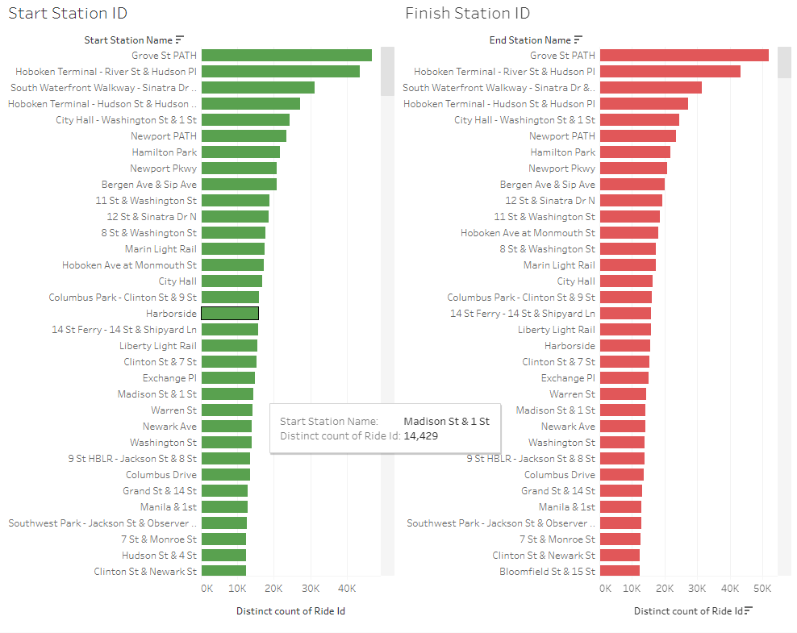

# Data-assignment-week18-challenge-Tableau

## Introduction
The data for the challenge was obtained from Citi Bike, 2024. Due to size limitations of Tableau public (1 GB), monthly 2023 data was downloaded individually and combined into one csv file. This formed the basis of the data for which analysis was conducted in Tableau.

The Tableau interactive dashboard is available via the below link:

https://public.tableau.com/views/Module18Challenge-TableauNewYorkBikeVisualisationFinal/DurationDashboard?:language=en-US&:sid=&:display_count=n&:origin=viz_share_link

## Start/End Station Analysis

The first piece of analysis is whether there is a disceranble difference between the starting (green) and ending (red) bike stations. When filtering for the distinct count of Ride IDs, the top 9 stations (filtered) were exactly the same based on distinct ID count. This would suggest that the users of the bikes start and finish in the same station location, instead of travelling to different locations. This suggested that the bikes were primarily being used by tourists to me who wanted to sight see around the streets where they started, but ultimately finish in the same location. This led me to my next piece of analysis, to analyse seasonal trend by user types.

## Seasonal Analysis

From the analysis conducted on start/end station location, it came as no suprise that the greatest two months were August and July respectively. These are two peak summer months were tourists would be enjoying the New York city area and would sight see via bike, starting and finishing at the same location. Interestingly the highest month of electric bike usage (red) was during the month of April. Conversely the months with the least usage are January and February, which supports the analysis that the bike usage would peak in summertime months and drop off during the peak of winter. Interestingly the casual members count followed the same trend, this also supports the hypothesis that tourists drive up the numbers during pleasant weather. I would suggest that 'casual' users are those who use the bikes on a one off on infrequent basis. I would also suggest it makes sense there is no spike in electric bikes during the peak summer months, as tourists are likely not as rushed for time and can therefore leisurely ride a classic bike.

## Duration Analysis

The average duration in minutes of the bike usage was calculated by manipulating the 'Started At' and 'Ended At' datetime data to create a new data set. The below formula which was influenced by similar formula on Community Tableau, 2024 successfully achieved this:

"IF DATETRUNC('day', [Started At])=DATETRUNC('day', [Ended At]) THEN

  DATEDIFF('minute',[Started At,[Ended At])"

The trend show a peak in average time duration between May - August, aligned with the best weather in the New York area. Interestingly the average range was only between 8.172 (February) and 11.588 (May) minutes, further analysis would be intriguing to determine if there are any outliers in this data, however the overarching trend does make sense and is aligned with previously analysis.

## Map

An interactive map of the data shows the starting bike stations (based on member or casual), and is dynamic based on months. I would suggest a rigurous audit of coordinate data would be needed for more analysis, as the data cordinates do not align with the street names after further analysis.

# References
Citi Bike. (2024). System Data. Citi Bike NYC. Retrieved May 5, 2024, from https://s3.amazonaws.com/tripdata/index.html

Community Tableau. (2024). How to calculate difference between 2 dates in minutes with condition. Tableau Community. Retrieved May 5, 2024, from https://community.tableau.com/s/question/0D54T00000NhzYxSAJ/how-to-calculate-difference-between-2-dates-in-minutes-with-condition